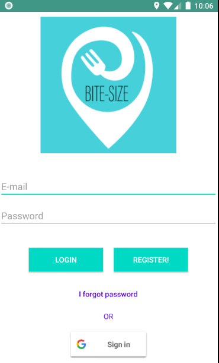
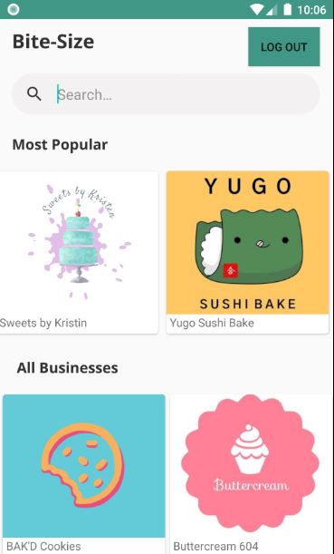
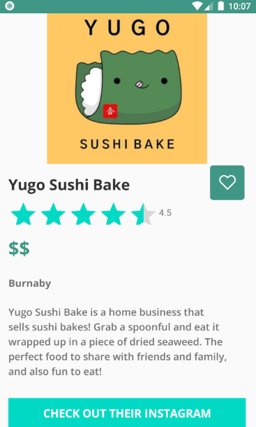
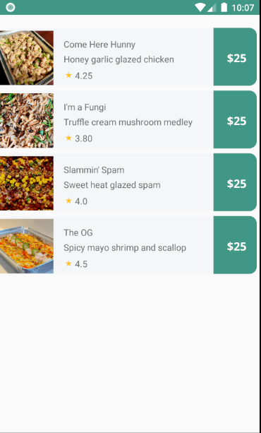

# Bite Size

Bite Size is an Android application, built using Java and Firebase, that gathers online food businesses (example: https://www.instagram.com/yugosushibake/) onto a central platform. Current problem is there doesn't exist a central place to find these small businesses (unlike Yelp), and they're hard to find outside of social media and word of mouth. We want to highlight small, local food businesses to everyone who wants to support them. They exist in communities everywhere around the world, and our app aims to connect them together.

## Screenshots

## Contributors
Dustin Brooks A01008765 dustinbrooks60@gmail.com  
Dillon Yeh A01061458 dillony3h@gmail.com  
Jacky Zheng A01086998 jackywzheng@gmail.com  

## Installation

Must be Android API Version 28 or greater.

## Usage

Fork the project and clone onto your desktop, and install on an emulator.

## Functionalities
Firebase authentication, login with either e-mail/pw or Google account (Google account only works on our computers due to SHA-1 certificate, unless we sign an apk)  
Firebase reset password  
Firebase logout  
Firebase read and write  
Search bar for tags or exact name match    
View businesses  
Direct link to business Instagram on button click  
Add and view reviews  
View menu items for each business  

## License
[BCIT]
